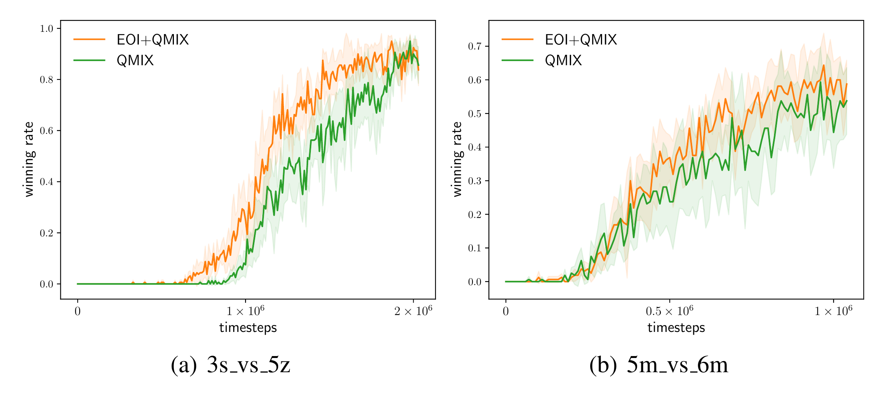

This is the codebase of improved EOI on general SMAC tasks. We have also published EOI on sparse-reward so_many_baneling in this [repo](https://github.com/jiechuanjiang/EOI_on_SMAC).

## Run an experiment
```
python3 src/main.py --config=eoi with explore_ratio=0.2 --env-config=sc2
```

Two parameters explore_ratio and episode_ratio control the strength of EOI exploration. The improved version of EOI could be seen as a multi-agent exploration method.

## Results



|               | 3s_vs_5z | 5m_vs_6m |
| ------------- | -------- | -------- |
| explore_ratio | 0.8      | 0.2      |

The agents are more likely to benefit from individualized behaviors if the trajectory is longer.
